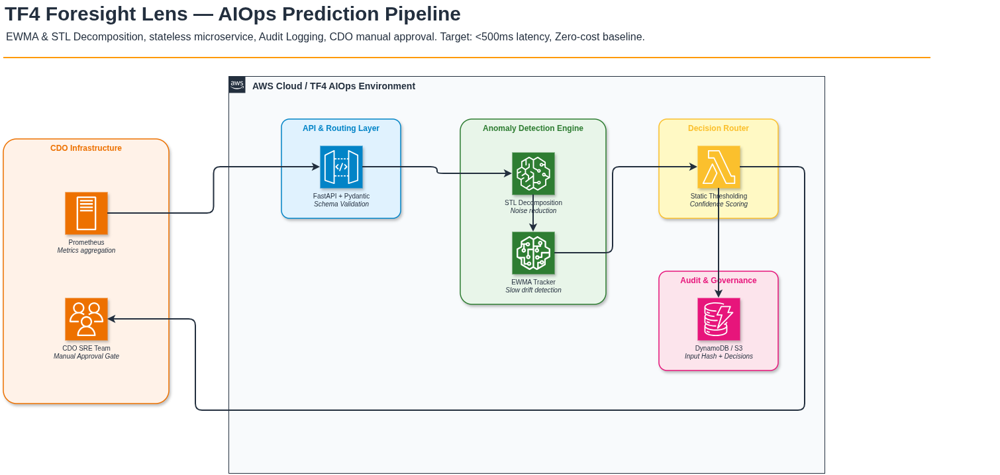

# Solution Design - Foresight Lens

<!-- Doc owner: AIO-03 Lead
 Status: Final (W11 T6 Pack #1)
 Word target: 1000-2000 từ -->

## 1. High-level architecture

*(Sơ đồ có thể chỉnh sửa: [02_solution_design.drawio](../diagrams/02_solution_design.drawio))*

**Diagram caption:** Luồng xử lý một chiều (Unidirectional Data Flow), AI Engine nhận dữ liệu chuỗi thời gian thông qua API, áp dụng thuật toán `EWMA & STL Decomposition` để rà soát bất thường, phân rã nhiễu, dự báo xu hướng và log lại mọi quyết định vào Audit Trail trước khi trả về Recommendation cho CDO.

Kiến trúc được thiết kế theo chuẩn **Microservices** tách biệt hoàn toàn khỏi hệ thống của nhóm CDO. Sự liên kết duy nhất giữa AI và CDO là các HTTP API Endpoints theo các chuẩn Schema được quy định chặt chẽ tại các Contracts.

## 2. Component breakdown

Hệ thống AI Engine bao gồm 4 khối kiến trúc chính:

| Component | Responsibility | Tech choice | Rationale |
|---|---|---|---|
| **API & Routing Layer** | Nhận tín hiệu, authenticate (nếu có), validate cấu trúc JSON schema và kiểm tra định danh tenant. | FastAPI + Pydantic (Python) | FastAPI cho tốc độ I/O vượt trội và tính năng tự động sinh Swagger UI. Pydantic đảm bảo dữ liệu đầu vào không bị rác (type-safe validation) ngay tại cổng. |
| **Anomaly Detection Engine** | Phân tích mảng chuỗi thời gian (time-series), tách nhiễu và phát hiện các dấu hiệu cạn kiệt tài nguyên từ sớm. | Python / NumPy (EWMA & STL Decomposition) | Thuật toán Thống kê chuẩn mực cho Infra Metrics. Bắt nhạy "Slow drift" của Memory Leak. Độ trễ (Latency) cực nhỏ < 5ms, tốn ít Compute, Cost ~$0, độ chính xác toán học 100%. |
| **Audit Logger & Storage** | Ghi lại toàn bộ lịch sử phân tích, mã băm (Input Hash) và quyết định (Decision) để phục vụ thanh tra và Traceability. | JSONL Logger, S3 / DynamoDB | Định dạng JSON dễ dàng query trên các hệ thống SIEM hoặc CloudWatch Logs. Đảm bảo Auditability (tuân thủ nguyên tắc quản trị AI). |
| **Decision Router** | Chuyển đổi điểm số (Anomaly Score) thành hành động cụ thể (`SCALE_UP` hoặc `INVESTIGATE`) dựa trên Confidence. | Static Thresholding (Ngưỡng tĩnh) | Đơn giản hóa quá trình diễn giải kết quả (Explainability). Dễ dàng tune threshold cho từng tenant để chặn cảnh báo nhiễu (Alert Fatigue). |

## 3. Data flow (Step-by-step Execution)

Toàn bộ quá trình từ khi nhận tín hiệu đến khi phản hồi kéo dài không quá 50ms (p99 latency).

1. **Step 1 (Ingestion & Normalization)**: Team CDO định kỳ tổng hợp dữ liệu metric (ví dụ: `cpu_usage_pct`, `memory_bytes_used`) trong một khung thời gian 60 phút và đóng gói thành mảng `signal_window`. Dữ liệu được push qua phương thức `POST /v1/predict`.
2. **Step 2 (Data Validation & Multi-tenant Routing)**: FastAPI layer lập tức kiểm tra sự tồn tại của header `X-Tenant-Id`. Nếu hợp lệ, Pydantic sẽ kiểm tra kiểu dữ liệu của mảng `signal_window` (bắt buộc timestamp chuẩn RFC3339, value kiểu float). Nếu bất kỳ trường nào sai định dạng -> Reject `HTTP 422 Unprocessable Entity` ngay lập tức.
3. **Step 3 (Core Processing - STL & EWMA)**:
 - Dữ liệu thô được đưa qua hàm STL Decomposition để loại bỏ nhiễu cục bộ (noise) và chu kỳ (seasonality), giữ lại xu hướng cốt lõi (trend).
 - Hàm Exponentially Weighted Moving Average (EWMA) sau đó rà quét trên trend này để tìm kiếm các vi phạm kéo dài (slow drift), so khớp với `STL Residual Threshold`.
 - Bất kỳ vi phạm nào vượt ngưỡng quy định đều kích hoạt biến cờ Anomaly.
4. **Step 4 (Confidence Scoring)**: Điểm số tự tin (Confidence) được tính bằng hàm Sigmoid hoặc Brier Scoring (từ 0.0 đến 1.0).
 - Nếu `Confidence < 0.7`: Action được hạ cấp xuống mức Cảnh báo quan sát (`INVESTIGATE`).
 - Nếu `Confidence >= 0.7`: Action được kích hoạt cảnh báo cực độ (`SCALE_UP`).
5. **Step 5 (Audit Trail Generation)**: Trước khi trả về kết quả, payload đầu vào được băm SHA-256 tạo thành `input_hash`. Hệ thống kết hợp hash này cùng thông tin `tenant_id`, `decision`, `confidence`, `execution_ms` để ghi ra log bảo mật (Audit log). Điều này là bắt buộc và không thể skip.
6. **Step 6 (Response Return)**: Trả về cục JSON cuối cùng cho CDO, cung cấp chính xác `action_verb`, đối tượng `target`, và đường dẫn bằng chứng `evidence_link`.

## 4. Alternatives considered (Kiến trúc thay thế)

Kiến trúc được lựa chọn dựa trên những sự đánh đổi (Trade-offs) khắt khe về mặt giới hạn chi phí và hiệu suất.

### 4.1 AI Pattern: GenAI (LLM) vs Statistical Model (EWMA & STL Decomposition)

- **Option A (LLM / Agentic Workflow)**: Đưa toàn bộ chuỗi dữ liệu (dạng text hoặc CSV) vào prompt cho Claude 3 Sonnet hoặc GPT-4o phân tích.
 - *Pros:* Có khả năng sinh ra bản tóm tắt nguyên nhân (Root Cause Analysis - RCA) bằng tiếng Anh/Việt trôi chảy, đọc hiểu rất trực quan cho con người.
 - *Cons:* Chi phí API đắt đỏ, gọi liên tục vài chục ngàn lần mỗi ngày sẽ phá vỡ giới hạn $200. Độ trễ quá cao (từ 2-10 giây) gây chậm trễ hệ thống CDO. Có rủi ro bịa đặt số liệu (Hallucination) ở các phép toán học đơn giản.
- **Option B (Statistical Model - EWMA & STL Decomposition)**: Tính toán rolling window dựa trên mô hình toán học thống kê phân rã truyền thống.
 - *Pros:* Tốc độ phản hồi tính bằng mili-giây (< 5ms), giải thích được tuyệt đối bằng công thức toán học, chi phí hoạt động hoàn toàn bằng $0 (chỉ tốn tiền CPU rất nhỏ của container FastAPI).
 - *Cons:* Không tạo ra được các đoạn văn bản phân tích phức tạp, chỉ trả về các tag JSON tĩnh. Cần người kỹ sư có khả năng đọc hiểu log và biểu đồ.
- **Chosen**: **Option B**. Lựa chọn này là Standard Pattern cho dữ liệu Infrastructure (Time-series data). Với ràng buộc $200 và yêu cầu phản hồi < 500ms, sự chính xác của toán học quan trọng hơn văn bản sinh ra từ LLM.

### 4.2 Data Storage: Time-Series DB (Prometheus) vs Stateless Payload

- **Option A (AI Query Prometheus)**: AI tự động móc nối (query) sang Prometheus của nhóm CDO để kéo dữ liệu định kỳ mỗi phút.
 - *Cons:* AI Engine bị ghép dính (Tight-coupling) vào hạ tầng của CDO. Nếu IP thay đổi hoặc DB quá tải, AI sẽ chết theo. Vi phạm ranh giới bảo mật mạng.
- **Option B (Stateless Push via API)**: Nhóm CDO chủ động đóng gói dữ liệu thành JSON và Push (POST) sang AI. AI Engine không có DB trạng thái (Stateless).
 - *Pros:* Tính độc lập hoàn toàn (Loose-coupling). Giao diện API rõ ràng, dễ làm mock test.
- **Chosen**: **Option B**.

## 5. Risk + mitigation (Quản trị rủi ro)

| Risk | Likelihood | Impact | Mitigation Strategy |
|---|---|---|---|
| **Alert Fatigue (Cảnh báo giả quá nhiều)** | Medium | High | Sự mệt mỏi vì cảnh báo sai có thể khiến SRE phớt lờ cảnh báo thật. Giải pháp: Sử dụng **Confidence Threshold > 0.7** để chặn spike nhỏ, khử seasonal bằng STL + EWMA control chart (K=4.0). FPR đo thật trên holdout là 7.1% (gate ≤12%). |
| **Data Bleed (Lẫn lộn dữ liệu Tenant)** | Low | High | Tenant A nhận cảnh báo do dữ liệu của Tenant B. Giải pháp: Ép buộc validate `X-Tenant-Id` ở tầng API. Context xử lý nội bộ của hàm tính toán khởi tạo lại (Stateless) ở mỗi HTTP request. |
| **Flash Sale / Expected Traffic Burst** | High | Medium | Hệ thống sẽ báo động OOM vì traffic tăng gấp 10 lần vào dịp Flash Sale. Giải pháp: Khuyến nghị CDO bổ sung cơ chế **Silence Alert (Tắt cảnh báo thủ công)** trong khung giờ diễn ra sự kiện. |
| **DDoS on AI Engine** | Medium | High | AI Engine sập do CDO gửi quá nhiều request. Giải pháp: Bật Rate Limit ở Middleware FastAPI (100 req/min/tenant). Trả HTTP 429 Too Many Requests nếu vi phạm. |

## 6. Open design questions & Technical Debt

- [x] **Q1: Nếu AI Engine sập (Outage), hệ thống của CDO sẽ ra sao?**
 - *Resolved:* Thiết kế cơ chế **Fail-open (Graceful Degradation)**. Nếu HTTP response trả về 5xx hoặc timeout, CDO sẽ tự động fallback (quay về) kịch bản Rule-based tĩnh cũ (vd: Hard-coded RAM > 90% thì báo động). Không để AI sập kéo CDO sập theo.
- [ ] **Technical Debt:** Việc tuning các tham số EWMA hiện đang là Hard-coded (Static Configuration). Trong tương lai, cần xây dựng một Cronjob hàng tuần chạy ML Pipeline tự động để Auto-tune lại threshold cho khớp với sự thay đổi của Baseline.

## Related documents

- [`03_ai_engine_spec.md`](03_ai_engine_spec.md) - Deep-dive vào thông số kỹ thuật, Thuật toán, Quản trị AI (Governance), và Security.
- [`04_eval_report.md`](04_eval_report.md) - Bằng chứng số liệu (Brier score, Precision, FPR).
- [`05_adrs.md`](05_adrs.md) - Architectural Decision Records (Lịch sử chốt kiến trúc).
- [`06_metrics_justification.md`](06_metrics_justification.md) - Bằng chứng toán học & URL tham chiếu bảo vệ các con số Hợp đồng.
- [`../contracts/ai-api-contract.md`](../contracts/ai-api-contract.md) - Khế ước API ký với CDO.
